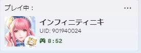

# Synth Riders Discord Rich Presence

A Discord Rich Presence integration for Synth Riders that shows your currently playing song in your Discord status.



## Features

- Shows your currently playing song in Discord
- Displays song name, artist, difficulty, and mapper information
- Works with both official and custom songs
- Uses Synth Riders' built-in song status export feature (no mods required!)
- Automatically detects when Synth Riders is running
- Minimal system tray application

## Requirements

- Synth Riders (Steam version)
- Discord desktop app running on the same computer
- Python 3.8 or newer (if running from source)

## Installation

1. Download the latest release from the [Releases page](https://github.com/yourusername/Synth-Riders-DiscordRPCv2/releases)
2. Extract the ZIP file to a location of your choice
3. Run `Synth Riders DiscordRPC.exe`
4. The application will start in the system tray

## Configuration

The application can be configured by editing the `settings/config.json` file:

```json
{
  "discord_application_id": "1124356298578870333",
  "song_status_path": "C:\\Program Files (x86)\\Steam\\steamapps\\common\\SynthRiders\\SynthRidersUC\\SongStatusOutput.txt",
  "cover_image_path": "C:\\Program Files (x86)\\Steam\\steamapps\\common\\SynthRiders\\SynthRidersUC\\SongStatusImage.png",
  "show_button": true,
  "button_label": "Play Synth Riders",
  "button_url": "https://synthridersvr.com"
}
```

### Options

- `discord_application_id`: The Discord application ID to use (default should work for most users)
- `song_status_path`: Path to Synth Riders' SongStatusOutput.txt file
- `cover_image_path`: Path to Synth Riders' SongStatusImage.png file
- `show_button`: Whether to show a button in the Discord presence (true/false)
- `button_label`: Text to display on the button
- `button_url`: URL to open when the button is clicked

## Setting Up Synth Riders

Synth Riders comes with a built-in feature to export the currently playing song information. To use it:

1. In Synth Riders, navigate to Settings
2. Make sure SongStatus is enabled
3. The game will automatically export song information when you play

## Running from Source

If you want to run the application from source:

1. Clone this repository
2. Install the required packages: `pip install -r requirements.txt`
3. Run `python main.py`

## Building the Executable

If you want to build the executable yourself:

1. For manual installation: Install PyInstaller using `pip install pyinstaller`
2. For automated build: Run the included `build.bat` file to install dependencies and build the application in one step
2. Run the following command to build the executable:

   ```bash
   pyinstaller --onefile --noconsole --icon=assets/logo.ico --add-data "assets/*;assets" --add-data "settings/*;settings" main.py
   ```

### Explanation of the Build Command

- `--onefile`: Packages everything into a single executable file.
- `--noconsole`: Hides the console window when running the application.
- `--icon=assets/logo.ico`: Specifies the icon for the executable.
- `--add-data "assets/*;assets"`: Includes all files in the `assets` folder.
- `--add-data "settings/*;settings"`: Includes all files in the `settings` folder.
- `main.py`: The entry point of the application.

Ensure that the `assets` and `settings` folders exist and contain the required files (e.g., `logo.ico`, configuration files, etc.) before running the build command.

## Credits

- Original implementation by [Original Author]
- Synth Riders integration by [Your Name]

`